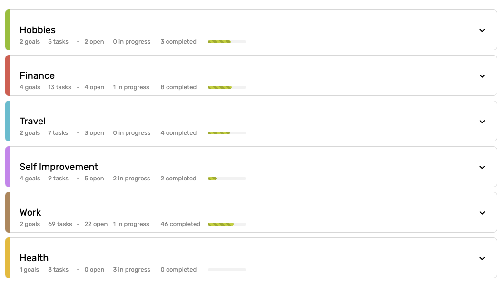
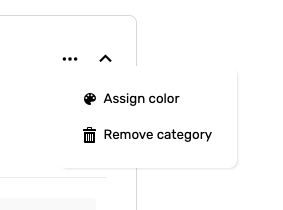
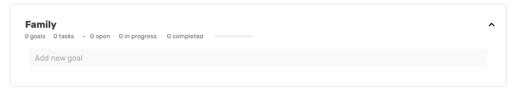

# My Goals

> The victory of success is half won when one gains the habit of setting and achieving goals. - Og Mandino

### Introduction

For half of my life, I just wandered around without any reasonable goals. I mean, I had plans. I kept them in my mind, changed the direction regularly, and never stick to most of them. It never felt right. More like constant unhappiness with the direction my life is going.

Setting goals provide direction, guides your focus, and helps you sustain momentum in life. It also helps to maintain motivation when you are down. And achieving the goals give a sense of personal satisfaction and accomplishment.

**Writing your goals down frees your mind to focus on other essential things in your life and helps to fight procrastination.**

### Categories

Look at your goal setting as a big mind map. What are the essential categories in your life? Your hobbies? Family? Work?

#### Create Categories

You can create new categories by clicking on the ‘Add new category’ field.

Type in your category name or pick a category from the predefined list of the most common categories.

#### Edit Categories

After opening the category you can access the category's action menu which allows you either to **remove the category** or **assign the color**.

### Goals

#### Adding Goals

Once you have your category, you can start adding goals by clicking on the Add new goal field.

Remember. To get the most out of your goals, use the SMART goals.

Smart goals are:

* **S**pecific: Well defined, clear
* **M**easurable: With specific criteria that measure your progress towards the accomplishment of the goal
* **A**chievable: Attainable, not impossible to achieve
* **R**ealistic: Within react and relevant to your life purpose
* **T**imely: Time-bound, trackable


e.g., “I want to get in shape.” is too general. A more specific goal would be “I want t get a gym membership at my local gym and work out three days a week.”


Each goal has two sections:

1. **Why do I want it?** - It’s crucial to think about why this goal is important to you. It gives the goal more meaning and a strong reason why you want to achieve the goal.
2. **How am I going to achieve it?** - Because a goal without the plan is just a wish, this is the part where you can create a plan. Split your goal into small, achievable tasks which you can later add to your weekly planning.

#### Editing Goals

You can edit the goal by clicking into the goal area. Hovering over the task with the mouse activates the action menu on the right-hand side where you can pick from **completing the goal** or **removing the goal**.

#### Goal Tasks

You can add as many tasks to your goal as you want.


I wouldn’t recommend adding too many. If that’s happening, you should consider splitting the goal into multiple goals. Goals with fewer tasks are easier to achieve, and achieving more gives you energy and boosts your motivation.


Create a new task by clicking in the ‘Add task’ field:

#### Editing Tasks

You can edit a task by clicking on it. Hovering over the task with the mouse activates the action menu on the right-hand side where you can pick from **multiple options.**

#### Add Subtask

Although I recommend keeping your goal tasks as simple as possible sometimes it needs more detail. You can add as many subtasks to your task as you want. However, if you have too many of them, as usual, I recommend splitting the task. Keep it simple.

#### Convert To Habit

Sometimes the task can be repetitive, _e.g. "Drink 2 liters of water every day!"._ For tasks like this, you can convert it to **"habit"** and decide on your own weekly scheduling. You can learn more about habits here.

#### Add To Current Week

You can easily add the task to the current week so it's ready to be worked on. You can also do it here.

#### Scheduled Task

Some tasks need to be worked on at some particular time. You can schedule your task for a specific week or day and time.

