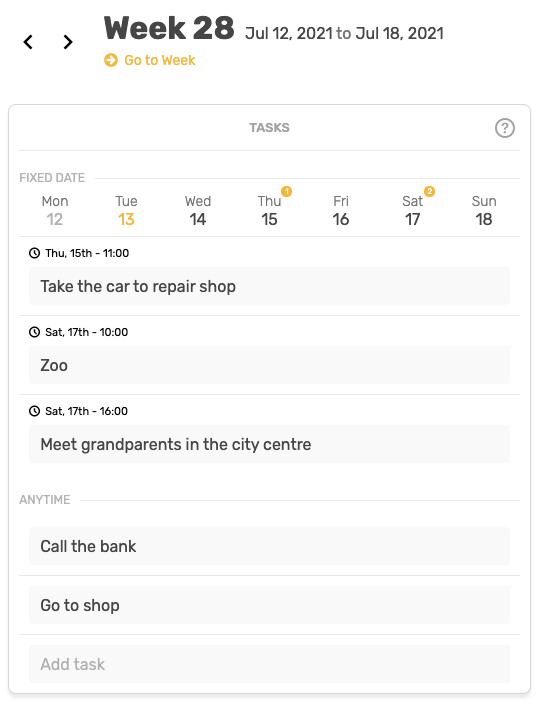
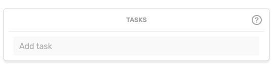
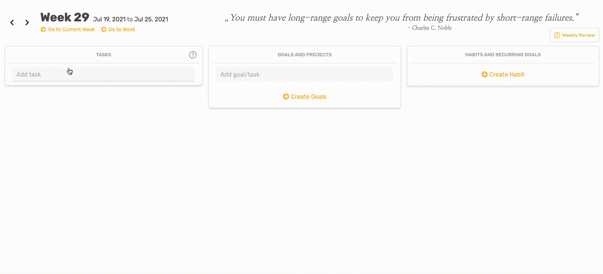
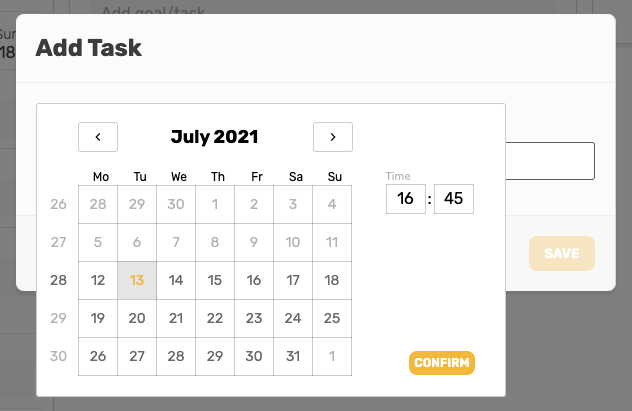
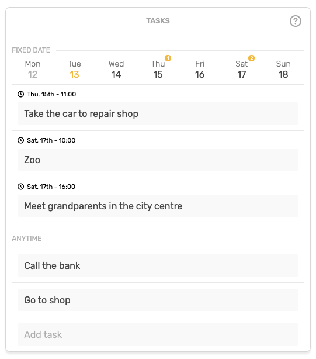

# Tasks

### Introduction

Day-to-day tasks that are not part of any long-term goal and can be executed at any point during the week or at the specific day and time, _e.g. a doctor appointment, go grocery shopping_.

### Add Task

Adding tasks is as simple as clicking to '**Add task**' box and start typing.

### Add Task With Fixed Date

If you have to finish your task at specific day and time \(e.g. appointment\) you can create a task with fixed date by simply clicking on '**Add task**' and '**Add time to task**'.

Task created with fixed time will apear in the **'Fixed date**' section of the **Tasks box**.


The "**Fixed date**" module will appear only if you have at least one fixed task in your weekly planning.


