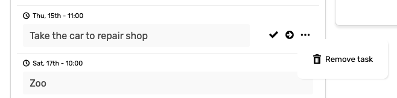
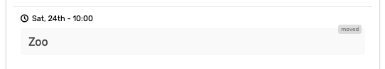
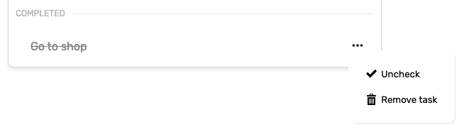

# Tasks

### Introduction

Day-to-day tasks that are not part of any long-term goal and can be executed at any point during the week or at the specific day and time, _e.g. a doctor appointment, go grocery shopping_.

### Add Task

Adding tasks is as simple as clicking to '**Add task**' box and start typing.

### Add Task With Fixed Date

If you have to finish your task at specific day and time \(e.g. appointment\) you can create a task with fixed date by simply clicking on '**Add task**' and '**Add time to task**'.

Task created with fixed time will apear in the **'Fixed date**' section of the **Tasks box**.


The "**Fixed date**" module will appear only if you have at least one fixed task in your weekly planning.


#### Tasks Actions

Each task has multiple actions:

* **Complete task** - Clicking on '**check**' icon you will complete the task. This action will move the task to the bottom of the Tasks box and mark it as '**completed**'. You can reverse this action.
* **Move task** - Clicking on '**right arrow**' icon you can move the task to the next week. 
* **Remove task** - Will delete the task permanently. This action can't be reversed.


**Move task** - Application keeps track of how many times has task been moved. If you attempt to move the task for the third time it will ask you if you want to remote the task. 

Moving task more than two times is **not recommended**. You either remove the task \(you obviously can't complete it\) or split the task to smaller tasks.


