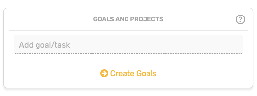
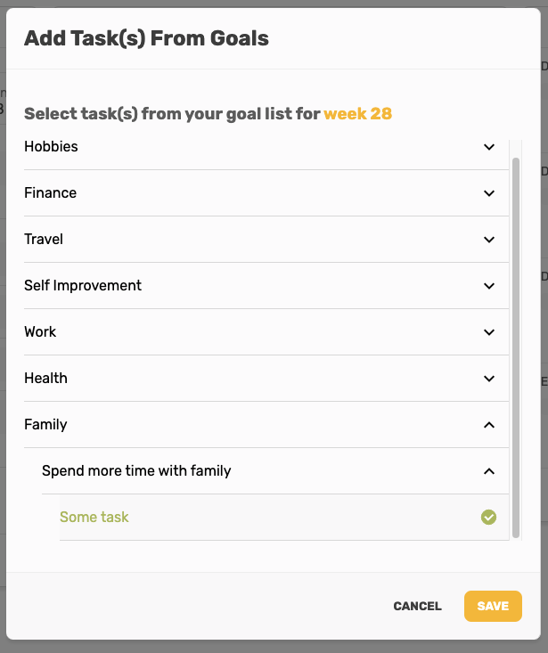
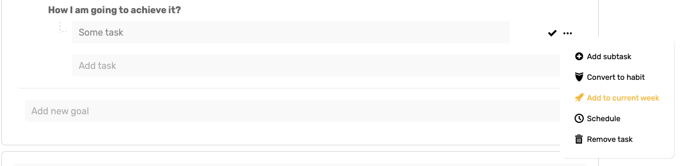
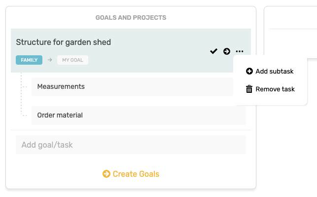

# Goals And Projects

### Introduction

Weekly tasks related to your long-term goals. To pick the task for the current week you first need to set up your goals in the [My Goals](../my-goals.md) section.

These tasks are directly assigned from your goals and contribute to the fulfillment of your yearly life goals.

[Learn how to set your yearly goals here.](../my-goals.md#introduction)

#### Add Goal/Task

There are two ways how to pick the task from your goals:

1. Click on the '**Add goal/task**' field. This will open the modal with a list of all your goals and their subtasks. You can pick one or multiple tasks that will be assigned to the currently selected week.

     2. Go to the [My Goals](../my-goals.md) section, find the task you want to assign to the current week, and click on '**Add to current week**' in the action menu.

#### Weekly Goal Actions

Once you have your goal task in the weekly planning you can:

1. Complete the task
2. Move it to the next week
3. Add subtasks
4. Remove it


Completing the task automatically completes all subtasks. Completing all subtasks automatically completes the task.


