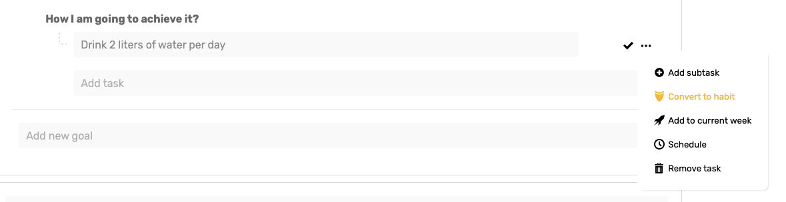

# Recurring Goals/Habits

### Introduction

Weekly recurring tasks related to your long-term goals. To pick the task for the current week you first need to set up your goals in the [My Goals](../my-goals.md) section.

These tasks are directly assigned from your goals and contribute to the fulfillment of your yearly life goals.

[Learn how to set your yearly goals here.](../my-goals.md#introduction)

#### Create recurring goal/habit

Once you have your goal ready you can click on the goal's **action menu** \(three dots\) and choose the '**Conver to habit**' option.

This action will open the '**Create recurring goal/habit**' modal where you can select how often do you want per week you would like the task to repeat.

#### Working With Recurring Goal/Habit

You can check and uncheck habit accomplishment by day. There are four different options for the habit recurring:

1. **Every Day** - Habit needs to be accomplished every day of the week \(7 times per week\)
2. **Every Working Day** - Habit needs to be accomplished every working day \(5 times per week\)
3. **Every Selected Day** - Habit needs to be accomplished on the selected days
4. **At Last X Days** - Habit needs to be accomplished at least X days per week

#### Achievements 

Once you checked enough habits completition for the week, you will see the '**Achieved**' tag. Well done!


It takes on average 66 days to create the habit. After 66 days or two months the application will ask you if you want to keep tracking the habit or to complete it.


